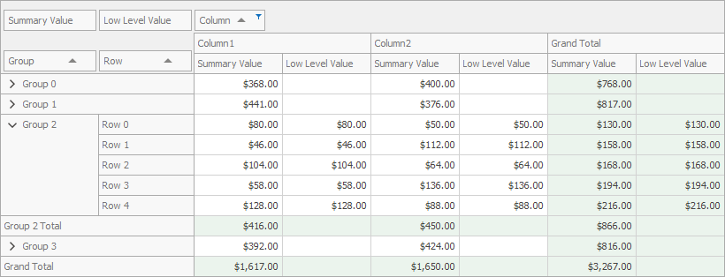

<!-- default badges list -->

<!-- default badges end -->
# How to Handle the CustomValueCell Event to Hide Row Totals

This example demonstrates how to use the [CustomCellValue](https://docs.devexpress.com/WindowsForms/DevExpress.XtraPivotGrid.PivotGridControl.CustomCellValue) event to hide field's row totals and grand totals. When field values are collapsed, the totals remain hidden.

API in this example:

* [PivotGridControl.CustomCellValue](https://docs.devexpress.com/WindowsForms/DevExpress.XtraPivotGrid.PivotGridControl.CustomCellValue) event
* [PivotGridControl.GetFieldsByArea](https://docs.devexpress.com/WindowsForms/DevExpress.XtraPivotGrid.PivotGridControl.GetFieldsByArea(DevExpress.XtraPivotGrid.PivotArea)) method
* [e.RowValueType](https://docs.devexpress.com/CoreLibraries/DevExpress.XtraPivotGrid.PivotCellEventArgsBase-3.RowValueType) property

**See also:**

* [Summarization - Totals](https://docs.devexpress.com/WindowsForms/1810)
* [UI Elements - Totals](https://docs.devexpress.com/WindowsForms/1691)
<!-- feedback -->
## Does this example address your development requirements/objectives?

 

(you will be redirected to DevExpress.com to submit your response)
<!-- feedback end -->
